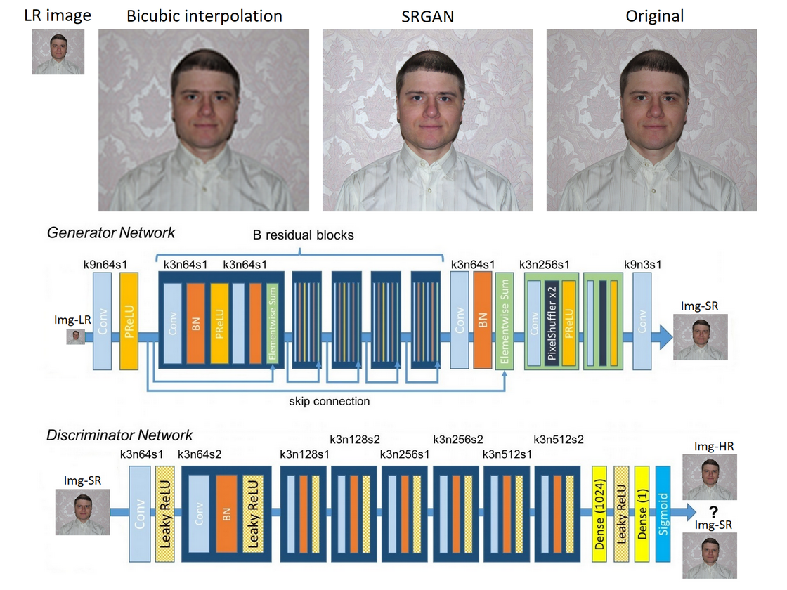
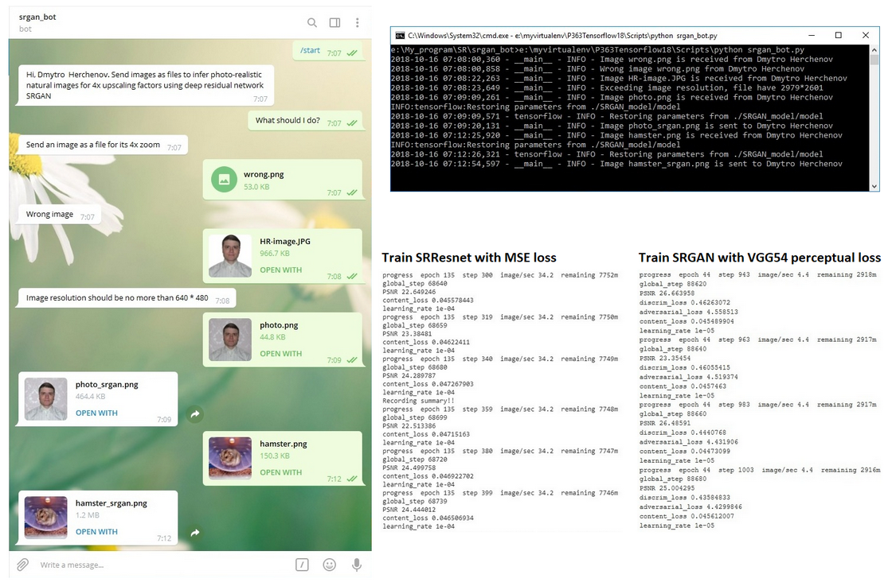
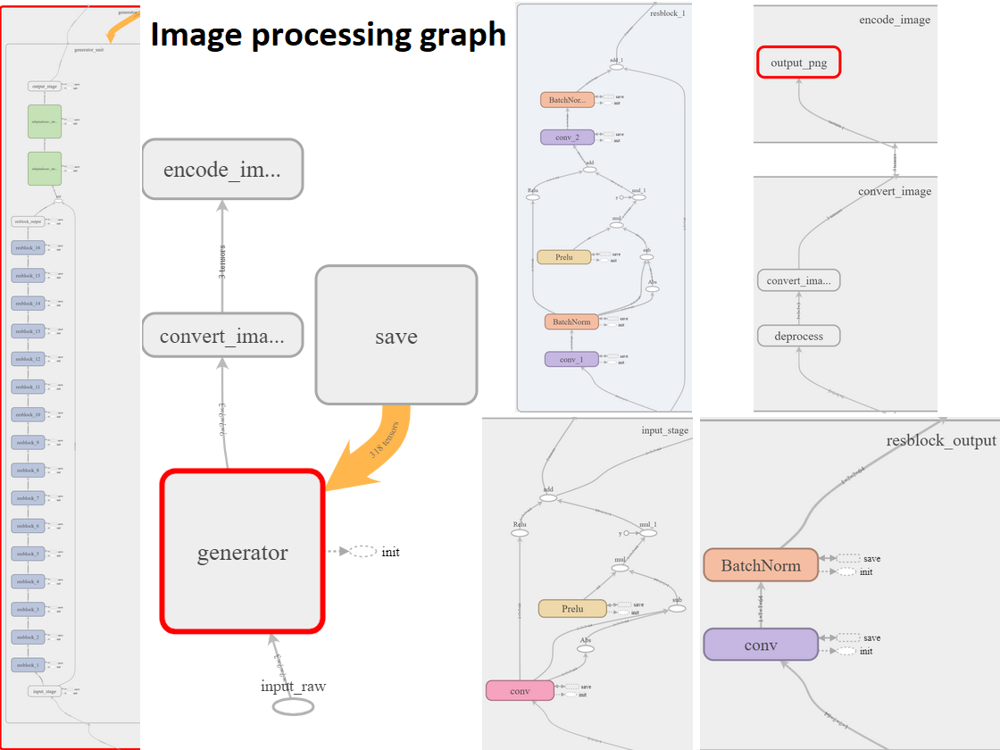
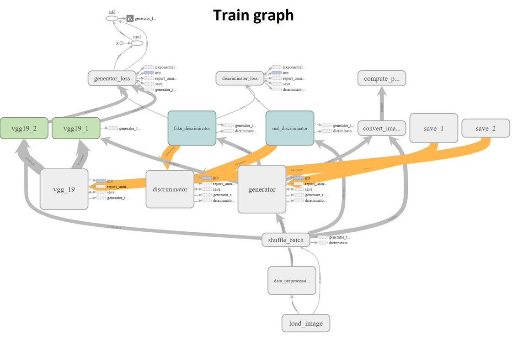

# Telegram chatbot service of inferring photo-realistic natural images for 4x upscaling factors using deep residual network

This project is a tensorflow implementation of the SRGAN algorithm for single image super-resolution https://arxiv.org/pdf/1609.04802.pdf with Telegram chatbot service as user interface to deep residual network.

## Details

  * Using convolutional neural networks(CNN) including deep residual networks(ResNet)
  * Tensorflow implementation of the SRGAN algorithm
  * SRGAN is able to recover photo-realistic textures from heavily downsampled images
  * Telegram chatbot service as user interface to model
  * python-telegram-bot library as Python interface for the Telegram Bot API
  * Enabled logging

To receive access token write Telegram BotFather http://t.me/BotFather and send command /newbot to create a new bot. Choose a name for your bot. Choose a username for your bot. It must end in 'bot'. BotFather sends you an access token and you put it into the program.

Bot has /start and /help commands, answers to text messages, gets JPG and PNG images as document(file). The program checks the input images for errors and for maximum resolution. Processing images with a resolution of 640*480 takes 10GB of memory(video memory, if you use videocard or system memory, if you use CPU). If you have more, you can increase the resolution.

## Requirements

  * Python 3.5+
  * macOS, Linux, Windows
  * modules:  python-telegram-bot, tensorflow, numpy, scipy, pillow
  * 10GB of memory for input images with a resolution of 640*480
